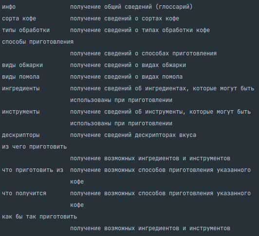
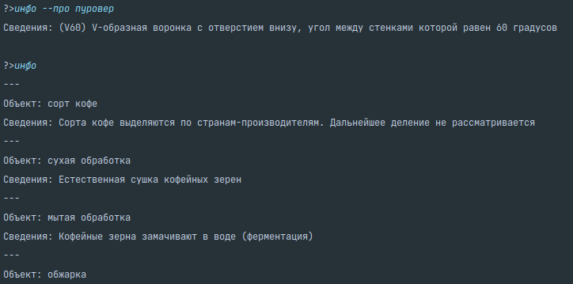
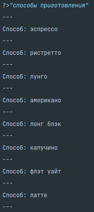
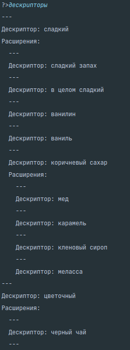
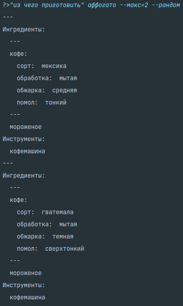
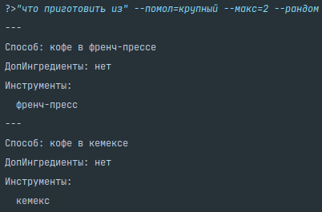
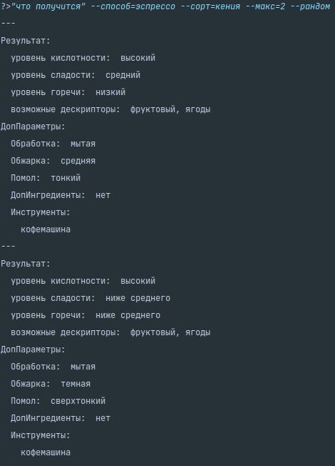
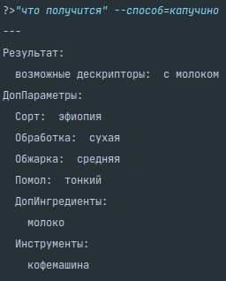
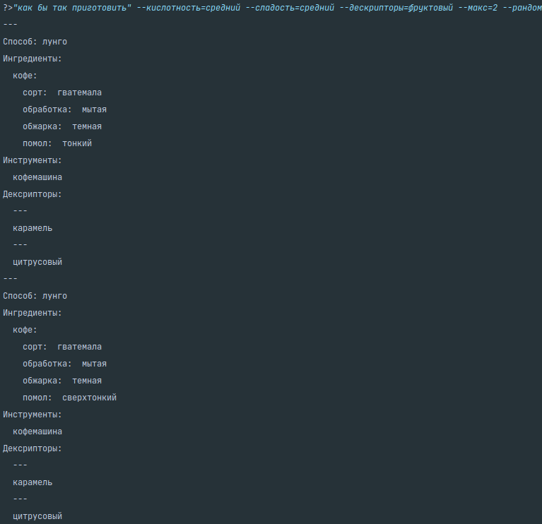

# Сорта кофейных напитов и особенности их приготовления

## Зависимости и запуск

**Требования**:
- Операционная система: Linux (с гарантией корректного запуска, другие потенциально на это способны)

- Внешние зависимости: [SWI Prolog](https://www.swi-prolog.org/download/stable)

- Программные зависимости (Python 3.6+):
```shell
pip3 install -r requirements.txt
```

**Запуск программы**
Запуск консольного приложения:
```shell
python3 main.py
```

Запуск prolog с импортом использованной базы знаний:
```shell
./run_prolog.sh
```


## Сведения о системе
Данная информационная система предоставляет доступ к систематизированным общим сведениям
о видах кофейных напитков, способов их приготовления и используемых ингредиентах,
а также позволяет оценить взаимосвязи между способом приготовления и получаемым в результате напитком.

Система разработана в формате консольного приложения, доступные команды приведены ниже.


Систему можно разделить на два блока:
- общая информация, которая включает в себя:
  - краткий глоссарий (команда ```инфо```)
  - обзор известных системе сущностей и значений, которые они могут принимать. Например, команда ```инструменты```
  выведет список инструментов, которые могут использоваться при приготовлении кофе
- специализированные запросы, ориентированные на анализ взаимосвязей между сущностями. Выделено 4 вида запросов (4 команды):
  - ```из чего приготовить``` позволяет подобрать ингредиенты для выбранного способа приготовления
  - ```что приготовить из``` подбирает способы приготовления, в которых можно использовать указанные ингредиенты
  - ```что получится``` строит оценку результата (кофейного напитка) на основании указанного способа приготовления и используемых ингредиентов
  - ```как бы так приготовить``` подбирает способы приготовления и ингредиенты таким образом, чтобы результат соответствовал указанным характеристикам.

Можно заметить, что специализированные вопросы отвечают за обработку двух видов зависимостей:
- между способом приготовления и используемыми ингредиентами
- между оценкой получаемого напитка и тем, как и из чего он готовился

Примечания к возможностям информационной системы:
- использование флагов для работы с массивами выводимых результатов:
  - ограничение количества выводимых ответов (limit)
  - отступ (offset)
  - случайное перемешивание ответов (shuffle)
- улучшенные возможности поиска (команда ```как бы так приготовить```) по наличию дескриптора, которые
включают в себя поиск под-дескрипторов (производных от указанного в иерархии "колеса вкусов")


## Примеры работы

#### Глоссарий



#### Общая информация

**Список инструментов**


**Список способов приготовления**



**"Колесо вкусов", или иерархическая система дескрипторов вкуса кофейных напитков**



#### Специализированные запросы

**Из чего приготовить**



**Что приготовить из**



**Что получится**






**Как бы так приготовить**


